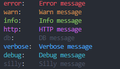

# Logger

## Basic Usage

##### index.ts
```ts
import logger from './logger';

const options: LoggerOptions = {
  level: 'silly',
  silent: process.env.NODE_ENV !== 'development',
  debugLog: {
    level: 'debug',
    filename: 'logs/debug-log-%DATE%.json',
    datePattern: 'YYYY-MM-DD',
    maxSize: '1g',
  },
  errorLog: {
    level: 'error',
    filename: 'logs/error-log-%DATE%.json',
    datePattern: 'YYYY-MM-DD',
    maxSize: '1g',
  },
};

logger.config(options);

logger.error('Error message');
logger.warn('Warn message');
logger.info('Info message');
logger.http('HTTP message');
logger.db('DB message');
logger.verbose('Verbose message');
logger.debug('Debug message');
logger.silly('Silly message');
```

### Output

